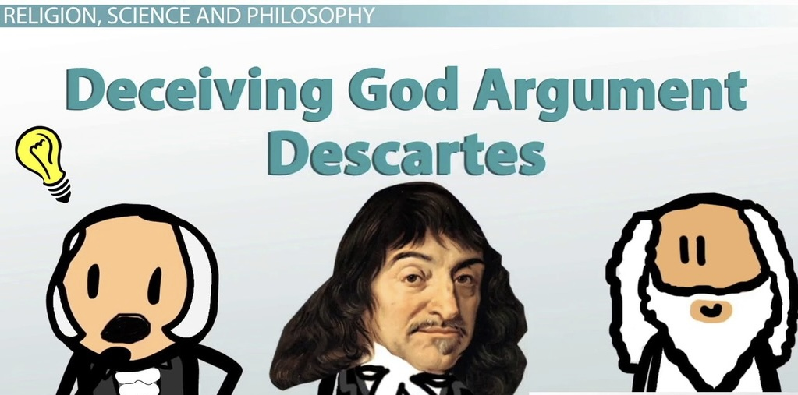

Philosophy, science and religion are three endeavours that shape in fundamental ways of how we think, what we value, and how we live. This report aims to explore different philosophers' perspectives on religion and science - how much did they care about those ideas (i.e. how often did they mention them) and how were their attitudes towards them (i.e. positive or negative). 

```{r, warning=FALSE, message=FALSE, echo=FALSE}
knitr::opts_chunk$set(echo = TRUE)
```

```{r, message=FALSE, warning=FALSE, echo=FALSE}
packages.used=c("tm", "tidytext","tidyverse","DT","wordcloud","scales","gridExtra","ngram","igraph","ggraph","rsconnect","RColorBrewer","ggplot2","ggwordcloud","syuzhet","ggpubr")

# check packages that need to be installed.
packages.needed=setdiff(packages.used, 
                        intersect(installed.packages()[,1], 
                        packages.used))

# install additional packages
if(length(packages.needed)>0){
  install.packages(packages.needed, dependencies = TRUE)
}

# load packages
library(tm)
library(tidytext)
library(tidyverse)
library(DT)
library(wordcloud)
library(scales)
library(gridExtra)
library(ngram)
library(igraph)
library(ggraph)
library(rsconnect)
library(RColorBrewer)  
library(ggplot2)
library(ggwordcloud)
library(syuzhet)
library(ggpubr)
```

This notebook was prepared with the following environmental settings.

```{r}
print(R.version)
```

### Part 0: Data Processing and Data Cleanning

The dataset [philosophy_data](https://www.kaggle.com/datasets/kouroshalizadeh/history-of-philosophy) I used in this project is from kaggle website which compiles over 300,000 sentences from over 50 texts spanning 13 major schools of philosophy. Luckily, most of the text data were already cleaned so that we can use them directly and easily. 

```{r, warning=FALSE, message=FALSE, echo=FALSE}
urlfile<- '../data/philosophy_data.csv'
phi_data <- read.csv(urlfile, stringsAsFactors = FALSE)
```

Since we start from analyzing the relationship between philosophy and religion, I firstly extract the philosophical text which are related to religion from the dataset for further sentiment analysis. To filter out those data, I use *grepl()* to search for the keywords -- god, gods, religion, religious, theology, theological -- in each sentence from each row. By using this method, we find out a total of 8791 rows from our dataset. Grantedly, it is not a fully exhaustive way to find out all the religion-related text, but we think those data are big enough for us to conduct further text analysis. *(This religion-filtered data is uploaded to the output file as 'religion.csv')*

```{r, warning=FALSE, message=FALSE, echo=FALSE}
religion <- phi_data[grepl("gods",phi_data$tokenized_txt)|
                     grepl("god",phi_data$tokenized_txt)|
                     grepl("religion",phi_data$tokenized_txt)|
                     grepl("religious",phi_data$tokenized_txt)|
                     grepl("theology",phi_data$tokenized_txt)|
                     grepl("theological",phi_data$tokenized_txt),]

write_csv(religion, '../output/religion_data.csv')  
```

To better compare the relationship between philiosophy, religion and science, it is neccesary to control the "school" variable (i.e. comparing the idea of religion and science within the same philosopical schools). Since the dataset is too large, I decide to focus on two schools -- one with very positive idea towards religion and the other with very negative idea, and further explore their attitudes towards science. We will see which two schools are picked in part 1 and I will further process these two schools' data to analyze their perspectives on science in part 2. 


### Part 1: Philosophy and Religion

##### Question 1.1: Which schools mention the idea of religion frequently? 

To answer this question, I count the number of sentences related to the idea of religion by each school and sort them in a descending order. 

From the bar chart below, we can easily see that **Rationalism, Plato, German_idealism, Continental and Nietzsche** are the top 5 schools which mentioned religion frequently -- they all have more than 500 entries of text data related to religion. This gives us the idea that, if someone wants to know more about the religion idea in philosophy, we could recomend him or her to read those schools' books based on this observation. 

```{r, warning=FALSE, message=FALSE, echo=FALSE}
rel_sch <- unique(religion$school)
rel_count <- c()
for (i in rel_sch){
  rel_sch_i <- religion[religion$school == i,]
  count_i <- nrow(rel_sch_i)
  rel_count <- c(rel_count,count_i)
}

rel <- data.frame(school = rel_sch,count = rel_count)
rel <- rel[order(rel$count,decreasing = TRUE),]

ggplot(data = rel,
       aes(x = reorder(school,count), y = count, fill = school)) +
       geom_bar(stat="identity") + 
       scale_fill_brewer(palette="Set3") + 
       labs(x = "School", y = "Number of related sentences") +
       ggtitle("The Frequency of Religion Mentioned by Each School") + 
       coord_flip()
ggsave("../figs/religion_freq.jpg")
```

##### Question 1.2: Which schools have more positive attitude towards religion? Which schools are more negative? 

I try to answer this question by using the NRC sentimental analysis. This package helps to categorize and count the words as "positive" and "negative". I define the positive ratio as the percentage of positive words appeared in each schools' text and re-center the ratio at 50% level. In other words, if the value of a certain school is above 0, it tends to be positive towards the religion idea, and the bigger the number is, the more positive its attitude is.  

From the bar chart below, we can see that Rationalism seems to hold the most positive attitude among all the schools -- its value is around 0.12, meaning that ~62% of the text showing positiveness. On the other hand, Communism is in general more negative with only ~41% text showing positiveness. 

```{r, warning=FALSE, message=FALSE, echo=FALSE}
rel_series = tibble()
for (i in rel_sch){
  rel_i <- religion[(religion$school == i),]
  rel_stopwords <- c(stopwords("english"),'god','gods',
                     'religion','religions','religious',
                     'theology','theological')
  rel_docs <- VCorpus(VectorSource(rel_i$sentence_str))%>%
                      tm_map(content_transformer(tolower))%>%
                      tm_map(removePunctuation)%>%
                      tm_map(removeNumbers)%>%
                      tm_map(removeWords, rel_stopwords)%>%
                      tm_map(removeWords, character(0))%>%
                      tm_map(stripWhitespace)
  rel_tbl = tidy(rel_docs)
  rel_tbl$school = i
  rel_clean = rel_tbl %>% 
              select(school, text) %>%
              unnest_tokens(word, text) %>%
              right_join(get_sentiments("nrc")) %>%
              filter(!is.na(sentiment)) %>%
              count(sentiment, sort = TRUE)
  rel_clean$school = i
  rel_series <- rbind(rel_series, rel_clean)
}

rel_senti_tbl <- data.frame()
for (i in rel_sch){
  rel_pos = rel_series[(rel_series$school == i & rel_series$sentiment == 'positive'),]$n
  rel_neg = rel_series[(rel_series$school == i & rel_series$sentiment == 'negative'),]$n
  pos_ratio = rel_pos/(rel_pos+rel_neg) - 0.5
  rel_pos_df = data.frame(school = i,positiveness = pos_ratio)
  rel_senti_tbl = rbind(rel_senti_tbl,rel_pos_df)
}
rel_senti_tbl = rel_senti_tbl[order(rel_senti_tbl$positiveness,decreasing = TRUE),]

ggplot(data = rel_senti_tbl,
       aes(x = reorder(school, positiveness), y = positiveness)) +
       geom_col(aes(fill = positiveness), width = .6) +
       labs(x = "School", y = "Positive Ratio") +
       ggtitle("The Positiveness towards Religion in Each School") + 
       coord_flip()
ggsave("../figs/religion_postiveness.jpg")
```

##### Question 1.3: Sentiment Analysis by Words.  

Based on 1.2, I take a deeper look into the two extreme schools -- rationalism, the most positive one, and communism, the most negative one. I analyze their sentiment by using wordcloud to see which words are used frequently when they describe religion. I also access and visualize the top n words contributed for each sentiment by using the bar charts as shown below. 

```{r, warning=FALSE, message=FALSE, echo=FALSE}
rel_stopwords <- c(stopwords("english"),'god','gods',
                   'religion','religions','religious',
                   'theology','theological')

par(mfrow=c(1,2))
rel_rat <- religion[religion$school == 'rationalism',]
rel_docs_rat <- VCorpus(VectorSource(rel_rat$sentence_str))%>%
                        tm_map(content_transformer(tolower))%>%
                        tm_map(removePunctuation)%>%
                        tm_map(removeNumbers)%>%
                        tm_map(removeWords, rel_stopwords)%>%
                        tm_map(removeWords, character(0))%>%
                        tm_map(stripWhitespace)

rel_dtm_rat <- TermDocumentMatrix(rel_docs_rat) 
rel_matrix_rat <- as.matrix(rel_dtm_rat) 
rel_words_rat <- sort(rowSums(rel_matrix_rat),decreasing=TRUE) 
rel_df_rat <- data.frame(word = names(rel_words_rat),freq=rel_words_rat)

wordcloud(words = rel_df_rat$word, freq = rel_df_rat$freq, min.freq = 1, max.words=50, 
          random.order=FALSE,rot.per = 0.35,colors=brewer.pal(8, "Dark2"),scale=c(2.5,0.2))
text(x =0.5, y = 1, "Rationalism")

rel_com <- religion[religion$school == 'communism',]
rel_docs_com <- VCorpus(VectorSource(rel_com$sentence_str))%>%
                        tm_map(content_transformer(tolower))%>%
                        tm_map(removePunctuation)%>%
                        tm_map(removeNumbers)%>%
                        tm_map(removeWords, rel_stopwords)%>%
                        tm_map(removeWords, character(0))%>%
                        tm_map(stripWhitespace)

rel_dtm_com <- TermDocumentMatrix(rel_docs_com) 
rel_matrix_com <- as.matrix(rel_dtm_com) 
rel_words_com <- sort(rowSums(rel_matrix_com),decreasing=TRUE) 
rel_df_com <- data.frame(word = names(rel_words_com),freq=rel_words_com)

wordcloud(words = rel_df_com$word, freq = rel_df_com$freq, min.freq = 1, max.words=50, 
          random.order=FALSE,rot.per = 0.35,colors=brewer.pal(8, "Dark2"),scale=c(1.6,0.15))
text(x = 0.5, y = 1,"Communism")
```

```{r, warning=FALSE, message=FALSE, echo=FALSE}
rel_tbl_rat = tidy(rel_docs_rat)
rel_tbl_rat$school = 'rationalism'
rel_clean_rat = rel_tbl_rat %>% 
                select(school, text) %>%
                unnest_tokens(word, text)

rel_words_rat <-rel_clean_rat %>% 
                inner_join(get_sentiments("bing")) %>%
                count(word, sentiment, sort = TRUE) %>%
                ungroup()

rel_words_rat_bar <- rel_words_rat %>% 
                     group_by(sentiment) %>%
                     top_n(10) %>%
                     ggplot(aes(reorder(word, n), n, fill = sentiment)) +
                     geom_bar(alpha = 0.8, stat = "identity", show.legend = FALSE) +
                     facet_wrap(~sentiment, scales = "free_y") +
                     labs(y = NULL, x = NULL) +
                     ggtitle("                                                       Rationalism") +
                     coord_flip()

rel_tbl_com = tidy(rel_docs_com)
rel_tbl_com$school = 'communism'
rel_clean_com = rel_tbl_com %>% 
                select(school, text) %>%
                unnest_tokens(word, text)

rel_words_com <-rel_clean_com %>% 
                inner_join(get_sentiments("bing")) %>%
                count(word, sentiment, sort = TRUE) %>%
                ungroup()

rel_words_com_bar <- rel_words_com %>% 
                      group_by(sentiment) %>%
                      top_n(10) %>%
                      ggplot(aes(reorder(word, n), n, fill = sentiment)) +
                      geom_bar(alpha = 0.8, stat = "identity", show.legend = FALSE) +
                      facet_wrap(~sentiment, scales = "free_y") +
                      labs(y = NULL, x = NULL) +
                      ggtitle("                                                    Communism") + 
                      coord_flip()

ggarrange(rel_words_rat_bar, rel_words_com_bar, ncol = 1, nrow = 2)
ggsave("../figs/religion_word_freq.jpg")
```

For Rationalism, words that frequently appeared in the text are something like "love", "good", "wisdom" and "perfect", implying that rationalists believe God plays an active and effective role in human life. Even for the negative words like "evil" and "sin", they are more about describing the idea from Christianity rather than expressing criticism. Besides, we can also see that the positive words have shown up much more often than the negative words if we take a look at the x axis of the barplot, meaning that rationalism overall holds a very positive perspective towards religion.  

For Communism, most of the words, no matter positive ones or negative ones, are related to politics (e.g. "political", "laws", "revolunary") and labors (e.g. "labour", "peasantry", "work"). We can tell from those words that Communists tend to criticize that religion is always used as a tool to suppress pople and exploit labor forces by dictators. 


##### Question 1.4: Sentiment Analysis by Sentences. 

After looking into the single words from the text data, I continue the sentiment analysis on the sentence levle -- find the emontinally charged sentences in Rationalismm and Communism to see how those philosphers express their views on religion. To achieve this, I use the NRC sentiment analysis from the syuzhet package and sort each sentence by their score on "positive" in a descending order. This allows me to find both the positive and negative sentences related to religon written by each school. 

**Rationalism: **: 

```{r, warning=FALSE, message=FALSE, echo=FALSE}
sentence_rat = data.frame()
for(i in 1:nrow(rel_rat)){
  sentences=syuzhet::get_sentences(rel_rat$sentence_str[i])
  nrc_data <- get_nrc_sentiment(sentences)
  sentence_rat <- rbind(sentence_rat,nrc_data)
}

sent_rate_rat = sentence_rat[order(sentence_rat$positive, decreasing = TRUE),]
index_rat = rownames(sent_rate_rat)
pos_rat = head(index_rat,3)

pos_sent_rat = c()
for (i in pos_rat){
  sent_i <- rel_rat$sentence_str[as.numeric(i)]
  pos_sent_rat <- c(pos_sent_rat,sent_i)
}
pos_sent_rat
```

These sentences from Rationalism express the idea that God is great and infinite in nature and is the creator of all things: He can recoginze things sooner and more readily than human beings but gives people the freedom to percept things. This Rationalism's positiveness towards religion shown in the sentences aligns with what we have already seen from the word analysis. But by looking into the sentences, we can get a one-step deeper understanding of the Rationalism's ideology which we couldn't tell from the previous analysis -- rationalism was not opposed to the existence of God and how good the God is, but they assert that it is important for humans to properly use the intellect to grasp the truths.  

**Communism: **

```{r, warning=FALSE, message=FALSE, echo=FALSE}
sentence_com = data.frame()
for(i in 1:nrow(rel_com)){
  sentences=syuzhet::get_sentences(removePunctuation(rel_com$sentence_str[i]))
  nrc_data <- get_nrc_sentiment(sentences)
  sentence_com <- rbind(sentence_com,nrc_data)
}

sent_rate_com = sentence_com[order(sentence_com$negative, decreasing = TRUE),]
index_com = rownames(sent_rate_com)
neg_com = head(index_com,3)

neg_sent_com = c()
for (i in neg_com){
  sent_i <- rel_com$sentence_str[as.numeric(i)]
  neg_sent_com <- c(neg_sent_com,sent_i)
}
neg_sent_com
```
 
Similar to what we saw in 1.3, these sentences from Communism again show that religion was closely related to polticis and criticize that officials misaneoulsy persecute the religious sects and improperly use it as a way for political agitation and for drawing the masses into the political struggle. 
 

### Part 2: Philosophy and Science

##### Question 2.1: Which schools mention the idea of science frequently? 

Similiar to what I did in 1.1, I first filter out the science-related entries by using the keywords "science", "sciences", "scientific" and "scientifically", count the number of sentences related to science by each school, and sort them in a descending order. *(This science-filtered data is uploaded to the output file as 'science_data.csv')*

```{r, warning=FALSE, message=FALSE, echo=FALSE}
science <- phi_data[grepl("science",phi_data$tokenized_txt)|
                     grepl("sciences",phi_data$tokenized_txt)|
                     grepl("scientific",phi_data$tokenized_txt)|
                     grepl("scientifically",phi_data$tokenized_txt),]

write_csv(science, '../output/science_data.csv') 
```

From the bar chart below, we see that **Phenomenology, German_idealism, Analytic, Continental and Aristotle** are the top 5 schools which mentioned science frequently -- they all have more than 500 entries of text data related to science. 

```{r, warning=FALSE, message=FALSE, echo=FALSE}
sci_sch <- unique(science$school)
sci_count <- c()
for (i in sci_sch){
  sci_sch_i <- science[science$school == i,]
  count_i <- nrow(sci_sch_i)
  sci_count <- c(sci_count,count_i)
}

sci <- data.frame(school = sci_sch,count = sci_count)
sci <- sci[order(sci$count,decreasing = TRUE),]

ggplot(data = sci,
       aes(x = reorder(school,count), y = count, fill = school)) +
       geom_bar(stat="identity") + 
       scale_fill_brewer(palette="Set3") + 
       labs(x = "School", y = "Number of related sentences") +
       ggtitle("The Frequency of Science Mentioned by Each School") + 
       coord_flip()
ggsave("../figs/science_freq.jpg")
```

##### Question 2.2: How were Rationalism and Communism's attitudes towards science?

In part 1, we took a deep dive into the question that how were the philosophers thinking about religion. We have shown that among the 13 major schools of philosophy, Rationalism holds relatively more positive view on God and encourage people to properly use our intellect given by God to understand the world, while Communism holds relatively more negative view by criticizing that religion has been evolved into a political tool and a manifestation of government tyranny. 

In part 2, I continue my analysis in Rationalism and Communism and try to explore their perspectives towards science respectively. Before we get started, I first extract the text data from these two schools and filter out the science-related entries by using the keywords. 

```{r, warning=FALSE, message=FALSE, echo=FALSE}
sci_rat <- phi_data[phi_data$school == 'rationalism',]
sci_rat <- sci_rat[grepl("science",sci_rat$tokenized_txt)|
                   grepl("sciences",sci_rat$tokenized_txt)|
                   grepl("scientific",sci_rat$tokenized_txt)|
                   grepl("scientifically",sci_rat$tokenized_txt),]

sci_com <- phi_data[phi_data$school == 'communism',]
sci_com <- sci_com[grepl("science",sci_com$tokenized_txt)|
                   grepl("sciences",sci_com$tokenized_txt)|
                   grepl("scientific",sci_com$tokenized_txt)|
                   grepl("scientifically",sci_com$tokenized_txt),]
```

To get a sense of how do these two schools' think about science, I then use the NRC sentimental analysis from syuzhet package and access the scores on both negative and positive attitudes. In the bar charts below, the blue bars represent the positive scores for each sentence and the red bars represent the negative scores. We can see that both of the two schools have larger area in blue than in red, implying that both of them hold relatively positive views towards science. 

```{r,warning=FALSE, message=FALSE, echo=FALSE}
sci_sentence_rat = data.frame()
for(i in 1:nrow(sci_rat)){
  sentences=syuzhet::get_sentences(removePunctuation(sci_rat$sentence_str[i]))
  nrc_data <- get_nrc_sentiment(sentences)
  sent_i <- data.frame(sentence = rep(i,2), 
                       value = c(nrc_data$positive[1],nrc_data$negative[1]),
                       sentiment = c('positive','negative'))
  sci_sentence_rat <- rbind(sci_sentence_rat,sent_i)
}

sci_sentence_com = data.frame()
for(i in 1:nrow(sci_com)){
  sentences=syuzhet::get_sentences(removePunctuation(sci_com$sentence_str[i]))
  nrc_data <- get_nrc_sentiment(sentences)
  sent_i <- data.frame(sentence = rep(i,2), 
                       value = c(nrc_data$positive[1],nrc_data$negative[1]),
                       sentiment = c('positive','negative'))
  sci_sentence_com <- rbind(sci_sentence_com,sent_i)
}

sci_sent_rat_plot <- ggplot(sci_sentence_rat, 
                            aes(fill=sentiment, y=value, x=sentence)) + 
                     geom_bar(position="stack", stat="identity") +
                     ggtitle("         Science-related sentences from Rationalism")

sci_sent_com_plot <- ggplot(sci_sentence_com, 
                            aes(fill=sentiment, y=value, x=sentence)) + 
                     geom_bar(position="stack", stat="identity") +
                     ggtitle("         Science-related sentences from Communism")

ggarrange(sci_sent_rat_plot, sci_sent_com_plot, ncol = 1, nrow = 2)
ggsave("../figs/science_sentence.jpg")
```


##### Question 2.3: What were the words used to describe science frequently? 

To answer this question, I again use the wordcloud to detect the words that were used frequently by these two schools when describing science. 

If we look at the two wordclouds together, we can see that most of the words are neutral to positive, such as "necessary","great", "development", and "modern", implying that both of the two schools believe science is good and useful. 

To be more specific, for Rationalism, we can see that those words are mainly related to "nature", "mind"" and "truth", and the verbs here are more about "study" and "apply". It actually aligns with what we have concluded in part 1 that rationalism encourages people to learn how to properly use our minds to study the nature and find the truth. Communism, on the other hand, even it shows positive attitudes science, the words are still related to "political" and "labor". It is not very surprised as socialism and production are always the core ideas of communism and communists are always commited themselves to exploring what is benficial to the society (probably science).

```{r, warning=FALSE, message=FALSE, echo=FALSE}
sci_stopwords <- c(stopwords("english"), 'science','sciences','scientific','scientifically')

par(mfrow=c(1,2))
sci_docs_rat <- VCorpus(VectorSource(sci_rat$sentence_str))%>%
                        tm_map(content_transformer(tolower))%>%
                        tm_map(removePunctuation)%>%
                        tm_map(removeNumbers)%>%
                        tm_map(removeWords, sci_stopwords)%>%
                        tm_map(removeWords, character(0))%>%
                        tm_map(stripWhitespace)

sci_dtm_rat <- TermDocumentMatrix(sci_docs_rat) 
sci_matrix_rat <- as.matrix(sci_dtm_rat) 
sci_words_rat <- sort(rowSums(sci_matrix_rat),decreasing=TRUE) 
sci_df_rat <- data.frame(word = names(sci_words_rat),freq=sci_words_rat)

wordcloud(words = sci_df_rat$word, freq = sci_df_rat$freq, min.freq = 1, max.words=50, 
          random.order=FALSE,rot.per = 0.35,colors=brewer.pal(8, "Dark2"),scale=c(2.3,0.2))
text(x = 0.5, y = 1,"Rationalism")

sci_docs_com <- VCorpus(VectorSource(sci_com$sentence_str))%>%
                        tm_map(content_transformer(tolower))%>%
                        tm_map(removePunctuation)%>%
                        tm_map(removeNumbers)%>%
                        tm_map(removeWords, sci_stopwords)%>%
                        tm_map(removeWords, character(0))%>%
                        tm_map(stripWhitespace)

sci_dtm_com <- TermDocumentMatrix(sci_docs_com) 
sci_matrix_com <- as.matrix(sci_dtm_com) 
sci_words_com <- sort(rowSums(sci_matrix_com),decreasing=TRUE) 
sci_df_com <- data.frame(word = names(sci_words_com),freq=sci_words_com)

wordcloud(words = sci_df_com$word, freq = sci_df_com$freq, min.freq = 1, max.words=50, 
          random.order=FALSE,rot.per = 0.35,colors=brewer.pal(8, "Dark2"),scale=c(2,0.2))
text(x = 0.5, y = 1,"Communism")
```

### Conclusion and Further Thoughts

Religion and Science are two important topics that are actively dicussed by philosophers no matter in history or today. Through this project, I have three main findings by investigating into the philosophical text data:

1. Rationalism, Plato, German_idealism, Continental and Nietzsche are the top 5 schools which discussed religion frequently, while Phenomenology, German_idealism, Analytic, Continental and Aristotle are the top 5 which mentioned science frequently. 

2. Rationalism seems to hold the most positive view towards religion among all 13 major schools of religion. It describes the God as "great" and "infinite". At the same time, it also claims the necessity of science for the human beings to understand the world. By combining their perspectives towards both religion and science, we can see the core ideology of rationalism -- a class of truths created by God exists that the intellect can grasp directly. 

3. Communism is considered to hold the most negative view towards religion, mainly because it thinks that religion has evolved into a political tool for the officials to suppress people and exploit labor forces. By analyzing the science-related text, we can see that communists are trying to seek some scientific way to establish a socioeconomic order which is centered around common ownership of the means of production, distribution, and exchange. 

Since it is a relatively short project which we only have two weeks to work on, I decided to just focus on two schools to explore the relationship between philosophy, religion and science. In the future, we can take advantage of this extensive dataset to conduct sentiment analysis on other schools as well. We can also distinguish between different authors within the same school, because, for example, even in rationalism, René Descartes' main idea is still different from Baruch Spinoza and Gottfried Leibniz's. It may also a good idea to do topic clustering on religion and science, which could help us to see what aspects that different philosophers tend to focus on. 

